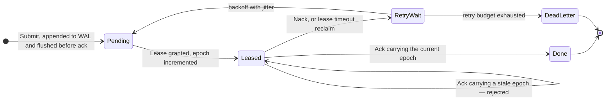

# Shikhar Goel

**Software Engineer** · distributed systems, static analysis, native apps — and the AI layer on top

Open to software engineering internships · Summer 2027

 

---

### `whoami`

|  |  |
|:--|:--|
| **Education** | B.E. Computer Engineering — Thapar Institute of Engineering &amp; Technology, 2024–2028 |
| **Based in** | India |
| **Works on** | Durable backend systems · static analysis · native macOS · agent and evaluation tooling |
| **Currently** | Hardening [conveyor-job-queue](https://github.com/sgoel2be24-cyber/conveyor-job-queue) and packaging [redoscope](https://github.com/sgoel2be24-cyber/redoscope) for release |
| **Reach me** | [Portfolio](https://portfolio-website-zeta-dun-27.vercel.app/) · [LinkedIn](https://www.linkedin.com/in/shikhar-goel01/) · [shikhardeepgoel@gmail.com](mailto:shikhardeepgoel@gmail.com) |

I build durable backend systems and developer tooling — crash-safe storage, fault-tolerant
dispatch, and analyzers that produce a working exploit rather than a warning. The agent and
evaluation work runs on the same stack.

---

## Open source

Patches landed in projects I use. Every row links to the merge or the landing commit.

| Project | Change | What it did |
|---|---|---|
| **[numpy/numpy](https://github.com/numpy/numpy)** | [#32386](https://github.com/numpy/numpy/pull/32386) ✅ **merged** | `BUG: close duplicated file descriptor if fdopen fails` — C-level fix for a descriptor leak in NumPy's error path, with regression tests handling WASM/musl. All 91 required CI checks passed. |
| **[google/adk-python](https://github.com/google/adk-python)** | [#6419](https://github.com/google/adk-python/pull/6419) ✅ **shipped in `v2.6.0` and `v2.8.0`** | `fix: handle Windows paths in adk eval` — the eval-case parser read the colon in `C:\` as a case selector. Google lands patches through Copybara, so the PR reads *closed* while the change sits on `main` as [`6f6106f`](https://github.com/google/adk-python/commit/6f6106f), authored by me. |
| **[apache/magpie](https://github.com/apache/magpie)** | [#1089](https://github.com/apache/magpie/pull/1089) ✅ **merged** | `fix(license-compliance-audit): handle large blobs and canonical SPDX` — files over ~1 MiB return without inline content, so the audit silently mis-flagged them as non-compliant. Fetches via raw-media API, separates *uninspected* from *violating*. Closed issue #944. |
| **[topoteretes/cognee](https://github.com/topoteretes/cognee)** | [#4126](https://github.com/topoteretes/cognee/pull/4126) ✅ **merged** | `fix(cli): reject dry runs in API dispatch mode` — `--dry-run` was silently ignored when `--api-url` was set, executing real remote operations. |
| **[corsairdev/corsair](https://github.com/corsairdev/corsair)** | [#1200](https://github.com/corsairdev/corsair/pull/1200) ✅ **merged** | `feat(pinecone): production-grade integration` — 48 operations across four API surfaces, typed Zod schemas, dynamic host routing. Landed as [`f7820d6`](https://github.com/corsairdev/corsair/commit/f7820d67e0e9ceb323a08e2d98fa112fa124053b), +3,948 across 26 files, closing issue #1199. |
| **[topoteretes/cognee](https://github.com/topoteretes/cognee)** | [#4161](https://github.com/topoteretes/cognee/pull/4161) 🔄 in review | `fix(api): scope configuration lookup to authenticated owner` — any authenticated user could read any config by UUID. |

Further review threads open in **Apache Airflow**, **pandas**, **LiteLLM**, **Buzz**,
**Microsoft Agent Framework** and **ADK** —
[see every open PR](https://github.com/search?q=author%3Asgoel2be24-cyber+is%3Apr+is%3Aopen+-user%3Asgoel2be24-cyber&type=pullrequests).

---

## Systems &amp; software

| Project | What it is |
|---|---|
| **[conveyor-job-queue](https://github.com/sgoel2be24-cyber/conveyor-job-queue)** `Go` `Connect RPC` `Protobuf` `Prometheus`    | Durable distributed job queue built around crash-safety: a CRC32C-checksummed, length-prefixed [write-ahead log](https://github.com/sgoel2be24-cyber/conveyor-job-queue/blob/main/internal/wal/wal.go) with torn-write detection, flushed with [`F_FULLFSYNC`](https://github.com/sgoel2be24-cyber/conveyor-job-queue/blob/main/internal/wal/sync_darwin.go) rather than plain `fsync`; [group commit](https://github.com/sgoel2be24-cyber/conveyor-job-queue/blob/main/internal/broker/commit.go) so N concurrent submitters share one flush; [lease and fencing logic](https://github.com/sgoel2be24-cyber/conveyor-job-queue/blob/main/internal/broker/store.go) with [jittered backoff](https://github.com/sgoel2be24-cyber/conveyor-job-queue/blob/main/internal/job/backoff.go) and dead-lettering. 32,232 submissions/sec, 7.7 ms recovery for 100K records.  **The hard part:** a worker that stalls for 30 seconds and comes back must not be able to acknowledge a job someone else now owns. The badges above are regenerated by CI, not typed here. |
| **[redoscope](https://github.com/sgoel2be24-cyber/redoscope)** `TypeScript` `Node ≥22.18` `zero deps` | ReDoS static analysis that verifies its own findings. Parses the full ECMAScript regex grammar, compiles to [an NFA](https://github.com/sgoel2be24-cyber/redoscope/blob/main/src/nfa.ts) modelling real backtracking, detects exponential and polynomial paths via [product automata](https://github.com/sgoel2be24-cyber/redoscope/blob/main/src/analysis.ts), then [generates a witness attack string and times it](https://github.com/sgoel2be24-cyber/redoscope/blob/main/src/dynamic.ts) inside a killable child process. [Benchmarked](https://github.com/sgoel2be24-cyber/redoscope/blob/main/bench/compare.ts) on **627 real-world regexes**: a star-height heuristic gave 10 false positives and missed 14 real vulnerabilities; this pipeline hit **0 false positives and 0 misses**.  **The hard part:** "looks risky" is not a vulnerability. The tool has to produce a concrete string that actually hangs the engine, and prove it with a measured growth curve. |
| **[rescuerelay](https://github.com/sgoel2be24-cyber/rescuerelay)** `Next.js 15` `TypeScript` `Leaflet` `Recharts` | Explainable crisis-resource coordination platform. Camps and clinics report needs, providers register available resources, and a deterministic matching engine ranks compatible pairings by priority, distance, availability and fairness — with a plain-language explanation attached to every recommendation. Offline-capable field intake for low-connectivity reporting. |
| **LiveEnv** — *private repo* `Next.js` `SQLite` `WebSocket` `IndexedDB` `MapLibre` | Local-first, decay-based geospatial social platform across four surfaces. Geohash-partitioned SQLite serving a hot TTL-swept table alongside durable transactional tables; paid placements settled through an append-only double-entry ledger so money never moves without minting the pin; IndexedDB offline outbox with idempotent client-ID-keyed sync. |
| **AgentBar** — *private repo* `Swift` `Xcode` `Keychain` `SQLite` | Native macOS menu bar app unifying usage tracking across six AI coding agents into one stacked bar with per-service metrics. Secure credential handling through macOS Keychain across heterogeneous sources; shipped as a signed `.dmg` under MIT. |

### How Conveyor survives a `kill -9`

The epoch is the fencing token. A lease timeout and an explicit `Nack` decrement the *same*
retry budget, so a poison-pill job cannot loop forever without reaching the dead-letter queue.

---

## AI engineering

| Project | What it is |
|---|---|
| **[modelgauntlet](https://github.com/sgoel2be24-cyber/modelgauntlet)** `Next.js` `Zod` `Ajv` `Vitest` | Pre-release testing platform that stress-tests structured AI tasks across open-source models and returns a deterministic **SHIP / FIX / BLOCK** verdict. One rule enforced end to end: AI proposes, deterministic TypeScript code decides — AI never grades AI. 23 automated tests across parsing, assertion, schema-validation and verdict boundaries. |
| **[multimodal-evidence-review](https://github.com/sgoel2be24-cyber/multimodal-evidence-review-orchestrate)** `Python` `Gemini 2.5 Flash` | Multimodal damage-claim adjudication pipeline — model output validated and repaired against a strict 14-column schema with tightly constrained enums. Semantic consistency rules lifted **claim-status accuracy from 70% to 85%** with zero additional model calls. SHA-256 content-addressed caching, resumable batch pipeline, graceful stop on quota errors. **Ranked #37 of 1,773.** |
| **[kaamtwin](https://github.com/sgoel2be24-cyber/kaamtwin)** `Next.js` `TypeScript` | Causal digital-twin simulator that reorders manufacturing order queues by deadline priority — 62 → 59 late deliveries in the demonstrated scenario, verified by **15 anti-hardcoding causal tests** (reversed-input, capacity, duration, immutable-hash) that rule out a hardcoded result. 67 automated tests at 88%+ coverage, 8/8 Chromium e2e, hardened CSP. |
| **[zero-token-router](https://github.com/sgoel2be24-cyber/zero-token-router)** `Python` | Hybrid router resolving deterministic tasks locally and escalating only genuinely hard work to LLMs. Passed **19/19 simulated evaluations** shipped as a public Linux/amd64 image under 4 GB RAM / 2 vCPU. |

---

## Experience

**AI Intern — Bharat Electronics Limited, Bengaluru** · Jul – Aug 2026
Backend API integrations in FastAPI, a React/Vite analytics dashboard turning application data into
usage, latency and performance views, and improvements to the project's RAG pipeline.

**Remote AI Intern — Facillima** · May – Jun 2026
Shipped an AI-native EdTech platform end to end in Next.js/TypeScript — technical SEO, structured
data, analytics instrumentation, third-party LMS integration — and led evaluation of the company's
LLM observability stack.

**Certifications** — Anthropic AI Fluency, MCP, Agent Skills and Subagents · Walmart Global Tech
Advanced Software Engineering · Deloitte Cyber · Google Ads Apps

---

## Toolkit

**Languages**

**AI &amp; agents** — *where most of my work sits*

**Concepts:** RAG · autonomous agents · multi-agent orchestration · deterministic verification · model evaluation &amp; benchmarking · release gating · prompt engineering · LLM observability

**Tools:** LangSmith · Braintrust · Zod · Ajv · Vitest · agent skills &amp; persistent memory

**Machine learning &amp; data**

**Concepts:** ensemble methods · CNNs &amp; Grad-CAM explainability · feature engineering · model calibration · ROC-AUC / permutation importance

**Systems &amp; infrastructure**

**Concepts:** write-ahead logging · crash recovery &amp; durability · fencing tokens · lease-based dispatch · group commit · static analysis / automata · local-first &amp; offline sync

**Backend, frontend &amp; stores**

**Core CS:** data structures &amp; algorithms · DBMS · object-oriented programming · distributed systems · software testing (pytest, Vitest, Ruff)

---

Conveyor's crash-safety and throughput figures are re-measured on every push by
[verify](https://github.com/sgoel2be24-cyber/conveyor-job-queue/actions/workflows/verify.yml).
