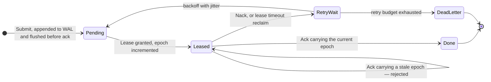

# Shikhar Goel

**Software Engineer** · distributed systems, static analysis, native apps — and the AI layer on top

 

  

---

### `whoami`

|  |  |
|:--|:--|
| **Education** | B.E. Computer Engineering — Thapar Institute of Engineering &amp; Technology, 2024–2028 |
| **Based in** | India |
| **Works on** | Durable backend systems · static analysis · build and test tooling · native macOS and Android · on-device and agent AI |
| **Currently** | Building **Netra**, an offline screen assistant for blind users on the Snapdragon NPU, and **Teachable Voice**, an Android assistant that learns a task from one demonstration |
| **Reach me** | [Portfolio](https://portfolio-website-zeta-dun-27.vercel.app/) · [LinkedIn](https://www.linkedin.com/in/shikhar-goel01/) · [shikhardeepgoel@gmail.com](mailto:shikhardeepgoel@gmail.com) |

I build durable backend systems and developer tooling — crash-safe storage, fault-tolerant
dispatch, and analyzers that produce a working exploit rather than a warning. The agent and
evaluation work runs on the same stack: deterministic checks around probabilistic models.

---

## Rankings &amp; awards

| Result | Event |
|---|---|
| 🥇 **#1 on the live leaderboard** | **Open Source Connect India '26**: 240+ merged pull requests across six projects. [Leaderboard](https://osci.osconnect.org/leaderboard) |
| 🏆 **Special Award Winner** | **HackBlox 2026**, open-source hackathon by Hackers Cult, judged on best project. Built [Pact](https://github.com/sgoel2be24-cyber/pact) |
| 🏅 **Finalist** | **DataForge 2026, IIT Kharagpur**: [Synapse Memory Lab](https://github.com/sgoel2be24-cyber/synapse-memory-lab-dataforge-2026-final) |
| **Top 1% in three editions** | **HackerRank Orchestrate 2026**, global 24-hour AI-agent hackathon<ul><li><b>Top 0.25%</b> of 15,000+ registrants in June · <a href="https://github.com/sgoel2be24-cyber/multimodal-evidence-review-orchestrate">multimodal-evidence-review</a></li><li><b>Top 0.65%</b> of 22,000+ registrants in August</li><li><b>Top 0.45%</b> of 30,000+ registrants in September · <a href="https://github.com/sgoel2be24-cyber/hackerrank-orchestrate-september-2026">Buy or Wait? agent</a></li></ul> |

---

## Selected builds

Each card replays the mechanism the project is built around. Click one to open the repo.

---

## Open source

**Open Source Connect India '26** — currently **#1 on the [live leaderboard](https://osci.osconnect.org/leaderboard)**, with 240+ merged pull requests across six projects.

What those pull requests fixed

 

Most landed in [SecureFlow](https://github.com/search?q=repo%3AGauravKarakoti%2FSecureFlow+author%3Asgoel2be24-cyber+is%3Apr+is%3Amerged&type=pullrequests),
a GitHub-App security scanner — broken Prisma queries, double-counted findings, mis-compiled ignore globs,
rate-limited AI explanations, and worker DLQ routing coverage taken from 57% to 96.5% — and in
[Truxify](https://github.com/search?q=repo%3AKanishJebaMathewM%2FTruxify+author%3Asgoel2be24-cyber+is%3Apr+is%3Amerged&type=pullrequests),
a logistics platform, re-landing reverted reliability fixes for retries, circuit breakers, upload scanning and sharding.
The rest went to [Air-Quality-Intelligence](https://github.com/search?q=repo%3AAseemPrasad%2FAir-Quality-Intelligence+author%3Asgoel2be24-cyber+is%3Apr+is%3Amerged&type=pullrequests) — timezone-correct UTC
timestamps, shared in-memory SQLite connections, half-open detection windows and per-station outage handling —
[TCalc](https://github.com/search?q=repo%3ASandesh13fr%2FTCalc+author%3Asgoel2be24-cyber+is%3Apr+is%3Amerged&type=pullrequests) — git-status path matching, token-drift report totals and agent-rule generators —
and [adaptq](https://github.com/search?q=repo%3Al3tchupkt%2Fadaptq+author%3Asgoel2be24-cyber+is%3Apr+is%3Amerged&type=pullrequests), whose CMake build now works on macOS arm64.

Upstream merges, each linked to its merge or landing commit. Click a change to see what it fixed.

| Project | Status | Change |
|---|---|---|
| **[apache/airflow](https://github.com/apache/airflow)** | [#71691](https://github.com/apache/airflow/pull/71691) · [#73323](https://github.com/apache/airflow/pull/73323) · [#73324](https://github.com/apache/airflow/pull/73324) ✅ **merged** | 

Three bug fixes, in Airflow core and the Amazon and Google providers
The deprecation shim in `airflow.utils.helpers` used bare `__import__` on dotted paths and got the top-level module back instead of the submodule, so moved functions like `render_template_as_native` raised `ImportError`; switched to `importlib.import_module`, with regression tests ([`bb3e71d`](https://github.com/apache/airflow/commit/bb3e71da4669dc0323eda3651dac18a9eed57275)). With `deferrable=True`, the EMR Serverless delete operator's inherited stop step deferred before any delete ran, so the task resumed on the stop event and reported success with the application still alive; stop completion now goes to a handler that validates the event and then deletes, closing issue #72123 ([`c5d7f60`](https://github.com/apache/airflow/commit/c5d7f60fffe7052b9def28b4ededb8a1573506b6)). With psycopg 3, `PostgresToGCSOperator`'s server-side cursor read rows through `fetchone()`, one `FETCH FORWARD 1` round trip per row with `cursor_itersize` ignored, so a reported 2M-row export slowed from about 5 to 90+ minutes; the cursor is now iterated in `itersize` batches, cutting a 100,000-row export from 100,001 fetches to 51, checked against Google's GCP system test before merge and closing issue #72075 ([`5ec2045`](https://github.com/apache/airflow/commit/5ec2045d4742750d25a73f2ec95f21301d79b561)).
 |
| **[google/adk-python](https://github.com/google/adk-python)** | [#6419](https://github.com/google/adk-python/pull/6419) · [#6705](https://github.com/google/adk-python/pull/6705) ✅ **shipped in Google releases** | 

A Windows-path fix and an eval regression test
`adk eval` read the colon in `C:\` as a case selector, so Windows paths broke; fixed the eval-case parser ([`6f6106f`](https://github.com/google/adk-python/commit/6f6106f672d26596f909bd555e954825ba4044b4), shipped in `v2.6.0`). Eval tools already received `EvalCase.session_input.state`, but instruction templates such as `{some_key}` historically did not during evaluation; added a `LocalEvalService` regression test so that path cannot silently break again, closing issue #5037 ([`3983fa1`](https://github.com/google/adk-python/commit/3983fa1c14870f08d02ce0f04bedb4b4ebb0dee9), shipped in `v2.10.0`). Google lands patches through Copybara, so both PRs read *closed* while the commits sit on `main`, authored by me.
 |
| **[apache/magpie](https://github.com/apache/magpie)** | [#1089](https://github.com/apache/magpie/pull/1089) ✅ **merged** | 

<code>fix(license-compliance-audit): handle large blobs and canonical SPDX</code>
Files over ~1 MiB return without inline content, so the audit silently mis-flagged them as non-compliant. Fetches via raw-media API, separates *uninspected* from *violating*. Closed issue #944.
 |
| **[numpy/numpy](https://github.com/numpy/numpy)** | [#32386](https://github.com/numpy/numpy/pull/32386) ✅ **merged** | 

<code>BUG: close duplicated file descriptor if fdopen fails</code>
C-level fix for a descriptor leak in NumPy's error path, with regression tests handling WASM/musl. All 91 required CI checks passed.
 |
| **[topoteretes/cognee](https://github.com/topoteretes/cognee)** | [#4126](https://github.com/topoteretes/cognee/pull/4126) ✅ **merged** | 

<code>fix(cli): reject dry runs in API dispatch mode</code>
`--dry-run` was silently ignored when `--api-url` was set, executing real remote operations.
 |
| **[corsairdev/corsair](https://github.com/corsairdev/corsair)** | [#1200](https://github.com/corsairdev/corsair/pull/1200) ✅ **merged** | 

<code>feat(pinecone): production-grade integration</code>
48 operations across four API surfaces, typed Zod schemas, dynamic host routing. Landed as [`f7820d6`](https://github.com/corsairdev/corsair/commit/f7820d67e0e9ceb323a08e2d98fa112fa124053b), +3,948 across 26 files, closing issue #1199.
 |
| **[risa-labs-inc/BossConsole](https://github.com/risa-labs-inc/BossConsole)** | [#324](https://github.com/risa-labs-inc/BossConsole/pull/324) · [#325](https://github.com/risa-labs-inc/BossConsole/pull/325) · [#477](https://github.com/risa-labs-inc/BossConsole/pull/477) · [#508](https://github.com/risa-labs-inc/BossConsole/pull/508) · [#509](https://github.com/risa-labs-inc/BossConsole/pull/509) ✅ **merged** | 

Five changes in a Kotlin desktop app
Plugin class loading made parallel-safe by serializing same-name first loads while independent classes still load concurrently ([`56de814`](https://github.com/risa-labs-inc/BossConsole/commit/56de814122ff7f2beca67963b836ef3e2785e2f9)); unloaded plugins stopped from resolving resources through the host ([`895c57e`](https://github.com/risa-labs-inc/BossConsole/commit/895c57ec92c3315a48512b7b815cecb0b83516b2)); heavyweight overlays made to honor RTL layouts and round fractional sizes instead of truncating, removing one-pixel drift at fractional display scales ([`21cc371`](https://github.com/risa-labs-inc/BossConsole/commit/21cc3716838c0b528a5417a3118cd6d0f4d2ce30)); a newer screen-capture request now cancels the callback it supersedes, so stale picker actions can no longer clear or resolve the request on screen ([`beca66c`](https://github.com/risa-labs-inc/BossConsole/commit/beca66cc010bfe007b3c3fed2a66cc7549c495cc)); and repository-wide convention scans hardened so generated `build/` trees cannot affect their results ([`89a6137`](https://github.com/risa-labs-inc/BossConsole/commit/89a61375f6f3d57b1138846b9cfc2755a8649486)).
 |

---

## Systems &amp; software

<b>conveyor-job-queue</b>: a Go job queue that lost no jobs across 50 <code>kill -9</code> trials

 

[Repo](https://github.com/sgoel2be24-cyber/conveyor-job-queue) · `Go` `Connect RPC` `Protobuf` `Prometheus`

Durable distributed job queue built around crash-safety: a CRC32C-checksummed, length-prefixed [write-ahead log](https://github.com/sgoel2be24-cyber/conveyor-job-queue/blob/main/internal/wal/wal.go) with torn-write detection, flushed with [`F_FULLFSYNC`](https://github.com/sgoel2be24-cyber/conveyor-job-queue/blob/main/internal/wal/sync_darwin.go) rather than plain `fsync`; [group commit](https://github.com/sgoel2be24-cyber/conveyor-job-queue/blob/main/internal/broker/commit.go) so N concurrent submitters share one flush; [lease and fencing logic](https://github.com/sgoel2be24-cyber/conveyor-job-queue/blob/main/internal/broker/store.go) with [jittered backoff](https://github.com/sgoel2be24-cyber/conveyor-job-queue/blob/main/internal/job/backoff.go) and dead-lettering. 32,232 submissions/sec, 7.7 ms recovery for 100K records.

**The hard part:** a worker that stalls for 30 seconds and comes back must not be able to acknowledge a job someone else now owns. The badges above are regenerated by CI, not typed here.

<b>redoscope</b>: a ReDoS analyzer with 0 false positives and 0 misses on 627 real regexes

 

[Repo](https://github.com/sgoel2be24-cyber/redoscope) · `TypeScript` `Node ≥22.18` `zero deps`

ReDoS static analysis that verifies its own findings. Parses the full ECMAScript regex grammar, compiles to [an NFA](https://github.com/sgoel2be24-cyber/redoscope/blob/main/src/nfa.ts) modelling real backtracking, detects exponential and polynomial paths via [product automata](https://github.com/sgoel2be24-cyber/redoscope/blob/main/src/analysis.ts), then [generates a witness attack string and times it](https://github.com/sgoel2be24-cyber/redoscope/blob/main/src/dynamic.ts) inside a killable child process. [Benchmarked](https://github.com/sgoel2be24-cyber/redoscope/blob/main/bench/compare.ts) on **627 real-world regexes**: a star-height heuristic gave 10 false positives and missed 14 real vulnerabilities; this pipeline hit **0 false positives and 0 misses**.

**The hard part:** "looks risky" is not a vulnerability. The tool has to produce a concrete string that actually hangs the engine, and prove it with a measured growth curve.

<b>forgegraph</b>: a Go build engine where one edit reruns 4 of 11 tasks and a warm rebuild takes 1 ms

 

[Repo](https://github.com/sgoel2be24-cyber/forgegraph) · `Go` `React Flow` `SSE`

Local incremental build engine in a single binary. Validates the task DAG with cycle paths, runs independent tasks on a [bounded parallel scheduler](https://github.com/sgoel2be24-cyber/forgegraph/blob/main/internal/engine/engine.go), and keys each [cache entry](https://github.com/sgoel2be24-cyber/forgegraph/blob/main/internal/cache/cache.go) by SHA-256 over command, environment digest, input contents and dependency fingerprints — content, not mtime. Every miss [names the input that changed](https://github.com/sgoel2be24-cyber/forgegraph/blob/main/internal/explain/explain.go), and an embedded dashboard streams the live graph, concurrency timeline and cache decisions.

<b>walscope</b>: a SQLite WAL inspector that never opens the database through SQLite

 

[Repo](https://github.com/sgoel2be24-cyber/walscope) · `Python` `SQLite internals`

Read-only inspector for SQLite write-ahead-log state. Parses the database header, [`-wal` frames](https://github.com/sgoel2be24-cyber/walscope/blob/main/src/walscope/wal.py) (salts, [rolling checksums](https://github.com/sgoel2be24-cyber/walscope/blob/main/src/walscope/wal_checksum.py), commit markers) and the [`-shm` wal-index](https://github.com/sgoel2be24-cyber/walscope/blob/main/src/walscope/wal_index.py) as plain files to report `mxFrame`, `nBackfill`, checkpoint lag and read marks. A built-in lab reproduces a pinned reader stalling the checkpoint (lag 25 frames) and its release (lag 0).

**The hard part:** it never calls `sqlite3.connect()` on the target — even a read-only open can run recovery and rewrite the very files being inspected. Tests enforce it.

<b>mutant</b>: browser mutation testing that caught 11 of 17 bugs a fully passing suite missed

 

[Repo](https://github.com/sgoel2be24-cyber/mutant) · [Live demo](https://mutant-omega.vercel.app) · `TypeScript` `acorn` `Web Workers`

A [hand-written AST engine](https://github.com/sgoel2be24-cyber/mutant/blob/main/src/lib/mutate.ts) injects real bugs — flipped operators, nudged boundaries, wiped constants, dropped guards — at the exact token, re-parses every mutant to guarantee valid JavaScript, and runs each against your tests in a disposable Web Worker with a hard timeout. Survivors come back as one-line diffs and every kill is attributed to the test that caught it. On the bundled GST example, a fully passing suite scores **35%**.

<b>Teachable Voice</b>: an Android assistant taught by one demonstration, 18/18 commands understood

 

[Repo](https://github.com/sgoel2be24-cyber/prism-teachable-voice) · `Kotlin` `Android Accessibility`

Say a command, perform it once in any app, and it replays on voice — with new values ("a Farmhouse instead", "two of them", "deliver to Work"), new wording and Hinglish. Runs only through the Accessibility Service, no app APIs or deep links; a tap-capture overlay records Compose and web-view taps that accessibility events miss. [Replay](https://github.com/sgoel2be24-cyber/prism-teachable-voice/blob/main/android/app/src/main/java/com/prism/tva/run/Executor.kt) is scored element matching with no network call, the language model steps in only when the screen differs, and a [payment/OTP/login guard](https://github.com/sgoel2be24-cyber/prism-teachable-voice/blob/main/android/app/src/main/java/com/prism/tva/core/Guard.kt) runs on every action. **7/7** cross-app runs (taught on Amazon, run on Myntra), 39 of 40 replay steps without the model.

<b>shramshield</b>: a heat-safety shift planner built on an ISO 7243 WBGT engine, 83 tests

 

[Repo](https://github.com/sgoel2be24-cyber/shramshield) · [Live](https://shramshield.vercel.app) · `TypeScript` `React` `Vitest`

Turns a weather forecast into an enforceable heat-safety shift plan for outdoor crews: shift window, work/rest minutes per hour, water, and stop-work hours. A framework-free [WBGT engine](https://github.com/sgoel2be24-cyber/shramshield/blob/main/src/lib/wbgt.ts) implements ISO 7243 and ACGIH screening limits and an optimiser ranks candidate windows — in the demonstrated Delhi forecast, moving the shift to 05:00 cuts time above the safe limit from 240 to 60 minutes.

<b>rescuerelay</b>: crisis-resource matching that explains every recommendation

 

[Repo](https://github.com/sgoel2be24-cyber/rescuerelay) · `Next.js 15` `TypeScript` `Leaflet` `Recharts`

Camps and clinics report needs, providers register available resources, and a deterministic matching engine ranks compatible pairings by priority, distance, availability and fairness — with a plain-language explanation attached to every recommendation. Offline-capable field intake for low-connectivity reporting.

<b>LiveEnv</b> <i>(private)</i>: a local-first geospatial platform with a double-entry ledger

 

`Next.js` `SQLite` `WebSocket` `IndexedDB` `MapLibre`

Decay-based geospatial social platform across four surfaces. Geohash-partitioned SQLite serving a hot TTL-swept table alongside durable transactional tables; paid placements settled through an append-only double-entry ledger so money never moves without minting the pin; IndexedDB offline outbox with idempotent client-ID-keyed sync.

<b>AgentBar</b> <i>(private)</i>: a native macOS menu bar app tracking six AI coding agents

 

`Swift` `Xcode` `Keychain` `SQLite`

Unifies usage tracking across Codex, Claude Code, Gemini, Cursor, OpenCode and Z.ai into one stacked bar with per-service metrics. Secure credential handling through macOS Keychain across heterogeneous sources; shipped as a signed `.dmg` under MIT.

### How Conveyor survives a `kill -9`

```mermaid
stateDiagram-v2
    direction LR
    [*] --> Pending: Submit, appended to WAL and flushed before ack
    Pending --> Leased: Lease granted, epoch incremented
    Leased --> Done: Ack carrying the current epoch
    Leased --> RetryWait: Nack, or lease timeout reclaim
    RetryWait --> Pending: backoff with jitter
    RetryWait --> DeadLetter: retry budget exhausted
    Leased --> Leased: Ack carrying a stale epoch — rejected
    Done --> [*]
    DeadLetter --> [*]
```

The epoch is the fencing token. A lease timeout and an explicit `Nack` decrement the *same*
retry budget, so a poison-pill job cannot loop forever without reaching the dead-letter queue.

---

## AI engineering

<b>Netra</b>: an offline screen assistant for blind users on the Snapdragon NPU, in English and Hindi

 

[Repo](https://github.com/sgoel2be24-cyber/netra) · `Python` `ONNX Runtime QNN` `Whisper` `VLM`

Press a key and ask about the screen, a scanned bill, or a medicine strip held to the webcam: [Whisper on the NPU](https://github.com/sgoel2be24-cyber/netra/blob/main/netra/asr/qnn_whisper.py) transcribes, a vision-language model reasons over the screenshot with OCR grounding, and the answer is spoken sentence by sentence while it is still generating, interruptible at any point. Nothing leaves the laptop — which is the point on banking, Aadhaar and medical screens that cloud describers would upload.

<b>BlindSpot</b>: a fraud-decline auditor that replays a 590,540-row benchmark byte-for-byte

 

[Repo](https://github.com/sgoel2be24-cyber/blindspot) · `Python` `scikit-learn` `Streamlit` `pytest`

Uncertainty-aware auditor for fraud-model declines under censored outcomes. Freezes a verification policy before outcomes are revealed, estimates false-decline rates with known sampling propensities, and reports when the review budget is too small to support a stable claim. 40 tests keep sealed labels out of the product path.

<b>WebMCP Incident Workspace</b>: an agent incident room where irreversible actions stay human-only

 

[Repo](https://github.com/sgoel2be24-cyber/webmcp-incident-workspace) · [Live demo](https://webmcp-incident-workspace.vercel.app) · `WebMCP` `JavaScript` `Vercel`

Human-agent incident command room with nine browser-native tools. Agents can compare deterministic remediation futures, but stale plans are rejected and irreversible actions remain human-only; successful execution emits a retrievable decision receipt. Verified through seven real-client scenarios and 18 automated tests.

<b>modelgauntlet</b>: SHIP / FIX / BLOCK release verdicts where AI never grades AI

 

[Repo](https://github.com/sgoel2be24-cyber/modelgauntlet) · `Next.js` `Zod` `Ajv` `Vitest`

Pre-release testing platform that stress-tests structured AI tasks across open-source models and returns a deterministic verdict. One rule enforced end to end: AI proposes, deterministic TypeScript code decides. 23 automated tests across parsing, assertion, schema-validation and verdict boundaries.

<b>multimodal-evidence-review</b>: claim accuracy lifted from 70% to 85%, top 0.25% of 15,000+ at HackerRank Orchestrate

 

[Repo](https://github.com/sgoel2be24-cyber/multimodal-evidence-review-orchestrate) · `Python` `Gemini 2.5 Flash`

Multimodal damage-claim adjudication pipeline — model output validated and repaired against a strict 14-column schema with tightly constrained enums. Semantic consistency rules lifted claim-status accuracy with zero additional model calls. SHA-256 content-addressed caching, resumable batch pipeline, graceful stop on quota errors. **Top 0.25% of 15,000+ registrants** at HackerRank Orchestrate, June 2026.

<b>Synapse Memory Lab</b>: DataForge 2026 finalist at IIT Kharagpur, an interactive essay on BDH-GPU memory

 

[Repo](https://github.com/sgoel2be24-cyber/synapse-memory-lab-dataforge-2026-final) · [Live](https://ishpreet0101.github.io/synapse-memory-lab-dataforge-2026/) · `TypeScript` `Canvas`

Three live labs show causal linear attention computed as Hebbian outer-product writes into a fixed-shape synaptic state, check that recurrent form numerically against an explicit-history oracle, and push an associative memory past capacity so interference becomes visible.

<b>hospital-readmission-risk</b>: a top-20% call list that catches 40% of readmissions

 

[Repo](https://github.com/sgoel2be24-cyber/hospital-readmission-risk) · `Python` `XGBoost` `LightGBM` `SHAP` `FastAPI`

30-day readmission model framed as a capacity question — *if the team can call 20% of today's discharges, which 20%?* Calling the top-risk fifth catches **40.2% of readmissions (2.05× lift)**. ROC-AUC 0.684 with patient-clustered bootstrap intervals, a seven-split robustness check that reports the published split as the most favourable, decision-curve analysis, SHAP reason codes, a scoring API and 27 tests.

<b>kaamtwin</b>: a scheduling twin proven by 15 anti-hardcoding causal tests

 

[Repo](https://github.com/sgoel2be24-cyber/kaamtwin) · `Next.js` `TypeScript`

Causal digital-twin simulator that reorders manufacturing order queues by deadline priority — 62 → 59 late deliveries in the demonstrated scenario, verified by causal tests (reversed-input, capacity, duration, immutable-hash) that rule out a hardcoded result. 67 automated tests at 88%+ coverage, 8/8 Chromium e2e, hardened CSP.

<b>zero-token-router</b>: 19/19 evaluations passed inside a 4 GB, 2-vCPU image

 

[Repo](https://github.com/sgoel2be24-cyber/zero-token-router) · `Python` `Fireworks AI API`

Hybrid router resolving deterministic tasks locally and escalating only genuinely hard work to Fireworks-hosted models, shipped as a public Linux/amd64 image.

---

## Experience

**AI Intern — Bharat Electronics Limited, Bengaluru** · Jul – Aug 2026 
Backend API integrations in FastAPI, a React/Vite analytics dashboard turning application data into
usage, latency and performance views, and improvements to the project's RAG pipeline.

**Remote AI Intern — Facillima** · May – Jun 2026 
Shipped an AI-native EdTech platform end to end in Next.js/TypeScript — technical SEO, structured
data, analytics instrumentation, third-party LMS integration — and led evaluation of the company's
LLM observability stack.

**Certifications** — Anthropic AI Fluency, MCP, Agent Skills and Subagents · Walmart Global Tech
Advanced Software Engineering · Deloitte Cyber · Google Ads Apps

---

## Toolkit

<b>AI &amp; agents</b>: runtimes, protocols and evaluation tooling

 

**Concepts:** RAG · autonomous agents · multi-agent orchestration · deterministic verification · model evaluation &amp; benchmarking · release gating · on-device NPU inference · prompt engineering · LLM observability

**Tools:** LangSmith · Braintrust · Zod · Ajv · Vitest · agent skills &amp; persistent memory

<b>Machine learning &amp; data</b>: modelling, explainability and evaluation

 

**Concepts:** ensemble methods · CNNs &amp; Grad-CAM explainability · feature engineering · model calibration · ROC-AUC / permutation importance · SHAP · decision-curve analysis

<b>Systems &amp; infrastructure</b>: durability, scheduling and delivery

 

**Concepts:** write-ahead logging · crash recovery &amp; durability · fencing tokens · lease-based dispatch · group commit · content-addressed caching · incremental builds · static analysis / automata · mutation testing · local-first &amp; offline sync

<b>Backend, frontend &amp; stores</b>: services, interfaces and databases

 

**Core CS:** data structures &amp; algorithms · DBMS · object-oriented programming · distributed systems · software testing (pytest, Vitest, Playwright, Ruff)

---

Conveyor's crash-safety and throughput figures are re-measured on every push by
[verify](https://github.com/sgoel2be24-cyber/conveyor-job-queue/actions/workflows/verify.yml).
The header and project cards are generated by the scripts in
[tools/](https://github.com/sgoel2be24-cyber/sgoel2be24-cyber/tree/main/tools).
